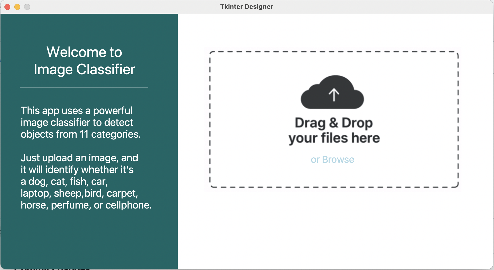

# 🧠 11-Class Image Classifier (Tkinter GUI)

A deep learning desktop app with a modern Tkinter-based graphical interface that classifies images into one of 11 categories. You can simply drag & drop an image, and the app will tell you what it is!

## 📸 Supported Classes

- 🐶 Dog  
- 🐱 Cat  
- 🐟 Fish  
- 🚗 Car  
- 💻 Laptop  
- 🐑 Sheep  
- 🐦 Bird  
- 🏇 Horse  
- 📱 Cellphone  
- 🧴 Perfume  
- 🧶 Carpet

---

## 🖼️ Interface Overview



> ✅ User-friendly drag & drop interface powered by Tkinter Designer  
> ✅ Instant image prediction after upload  
> ✅ Minimal and responsive layout

---

## 🚀 How to Use

### 1. Clone the repository
```bash
git clone https://github.com/HaniehGRN/11classImageClassifier.git
cd 11classImageClassifier
```

### 2. Install dependencies
```bash
pip install -r requirements.txt
```

### 3. Launch the app
```bash
python app.py
```

### 4. Use the interface
- Drag and drop an image into the dashed area, or click **Browse** to select manually.
- The app will process and display the predicted label.

---

## ⚙️ Tech Stack

- **Python 3.8+**
- **TensorFlow / Keras** (for model training)
- **Tkinter Designer** (for modern GUI)
- **Pillow** (for image handling)
- **NumPy, OpenCV**

---

## 🎯 Model Overview

A Convolutional Neural Network (CNN) trained on a custom dataset of 11 object categories. The model is saved as `.h5` and loaded dynamically within the app for inference.

---

## 📁 Project Structure

```
11classImageClassifier/
├── assets/
│   └── gui_screenshot.png
├── model/
│   └── classifier_model.h5
├── app.py
├── predict.py
├── requirements.txt
└── README.md
```

---

## 🧪 Results

| Metric     | Value     |
|------------|-----------|
| Accuracy   | ~96%      |
| Model Size | ~20 MB    |
| Inference  | < 1 sec   |

---

## 🙋‍♀️ Author

Developed by [HaniehGRN](https://github.com/HaniehGRN)

Feel free to fork, star, or contribute!
